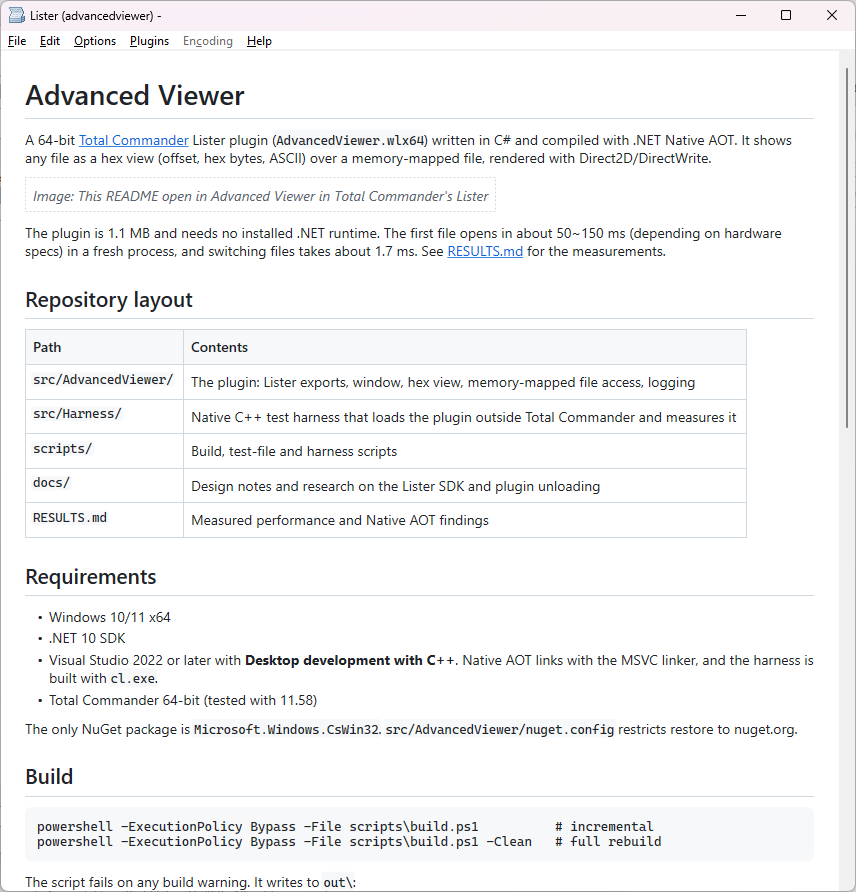

# Advanced Viewer

A 64-bit [Total Commander](https://www.ghisler.com/) Lister plugin (`AdvancedViewer.wlx64`) written in C# and compiled with .NET Native AOT. It shows any file as a hex view (offset, hex bytes, ASCII) over a memory-mapped file, rendered with Direct2D/DirectWrite.



The plugin is 1.1 MB and needs no installed .NET runtime. The first file opens in about 50~150 ms (depending on hardware specs) in a fresh process, and switching files takes about 1.7 ms. See [RESULTS.md](RESULTS.md) for the measurements.

## Repository layout

| Path | Contents |
| --- | --- |
| `src/AdvancedViewer/` | The plugin: Lister exports, window, hex view, memory-mapped file access, logging |
| `src/Harness/` | Native C++ test harness that loads the plugin outside Total Commander and measures it |
| `scripts/` | Build, test-file and harness scripts |
| `docs/` | Design notes and research on the Lister SDK and plugin unloading |
| `RESULTS.md` | Measured performance and Native AOT findings |

## Requirements

- Windows 10/11 x64
- .NET 10 SDK
- Visual Studio 2022 or later with **Desktop development with C++**. Native AOT links with the MSVC linker, and the harness is built with `cl.exe`.
- Total Commander 64-bit (tested with 11.58)

The only NuGet package is `Microsoft.Windows.CsWin32`. `src/AdvancedViewer/nuget.config` restricts restore to nuget.org.

## Build

```powershell
powershell -ExecutionPolicy Bypass -File scripts\build.ps1          # incremental
powershell -ExecutionPolicy Bypass -File scripts\build.ps1 -Clean   # full rebuild
```

The script fails on any build warning. It writes to `out\`:

| File | Purpose |
| --- | --- |
| `AdvancedViewer.wlx64` | The plugin |
| `AdvancedViewer-plugin.zip` | Plugin plus `pluginst.inf`, for installing from Total Commander |
| `throwtest\AdvancedViewer.wlx64` | Test build that throws when opening `__throw__.bin`, to exercise the exception catch-all |
| `dumpbin-exports.txt` | Exported functions. The build checks that all required Lister exports are present |
| `build-*.log` | Full publish output |

## Install in Total Commander

Open `out\AdvancedViewer-plugin.zip` in Total Commander and confirm the install prompt. Then press F3 or Ctrl+Q on any file.

The detect string matches every file. Total Commander caches it in `wincmd.ini` as `N_detect`. If you change the detect string, delete that key.

## Test

```powershell
# 1. Create the test files in testfiles\ (gitignored). Includes a 4.5 GB file unless -SkipHuge is given.
powershell -ExecutionPolicy Bypass -File scripts\make-testfiles.ps1

# 2. Build the harness if needed, then run all phases. Results are written to out\harness-results.json.
powershell -ExecutionPolicy Bypass -File scripts\run-harness.ps1

# Run a subset of phases. Quote the list, or PowerShell splits it into separate arguments.
powershell -ExecutionPolicy Bypass -File scripts\run-harness.ps1 --launches 5 --phases "loadtime,edge"
```

The phases are `loadtime`, `perfile`, `cycle`, `scroll`, `edge`, `throw` and `unload`. Run `src\Harness\bin\Harness.exe --help` for all options.

`scripts\lock-file.ps1` holds `testfiles\locked.bin` open with no sharing, for the manual locked-file check.

## Implementation notes

- Exports use `[UnmanagedCallersOnly]` with blittable parameters only. Every export and the window procedure catch all exceptions, because an escaping exception would crash Total Commander.
- CsWin32 runs with `allowMarshaling: false`, so Direct2D/DirectWrite COM interfaces are generated as unmanaged structs. Built-in COM interop is not available under Native AOT.
- All trim and AOT warnings are errors. None are suppressed.
- The gen0 GC budget is capped at 4 MB and concurrent GC is off. This keeps memory flat in Total Commander's long-lived process and adds no background GC thread.
- Once its runtime has started, the Native AOT DLL stays loaded even after `FreeLibrary`. Total Commander's unload is a no-op, not a crash. See [RESULTS.md](RESULTS.md#4-unload-findings).
- Known open issue: an I/O error on a mapped file, such as a truncated file or a disconnected share, raises an SEH exception that managed code cannot catch. See [RESULTS.md](RESULTS.md#6-problems-the-full-viewer-will-face).
